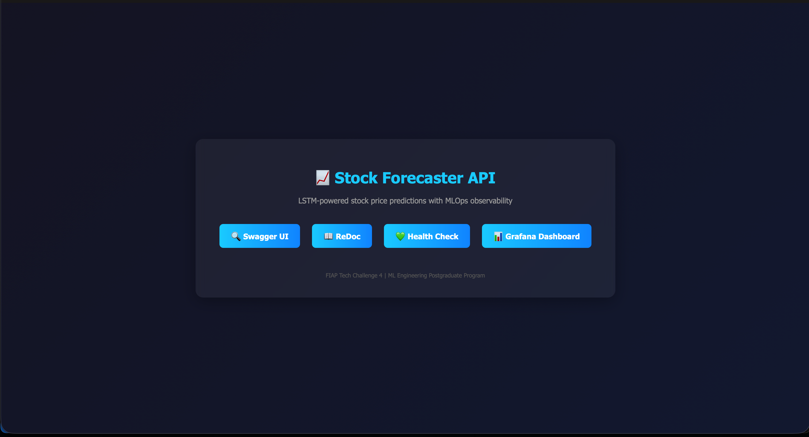
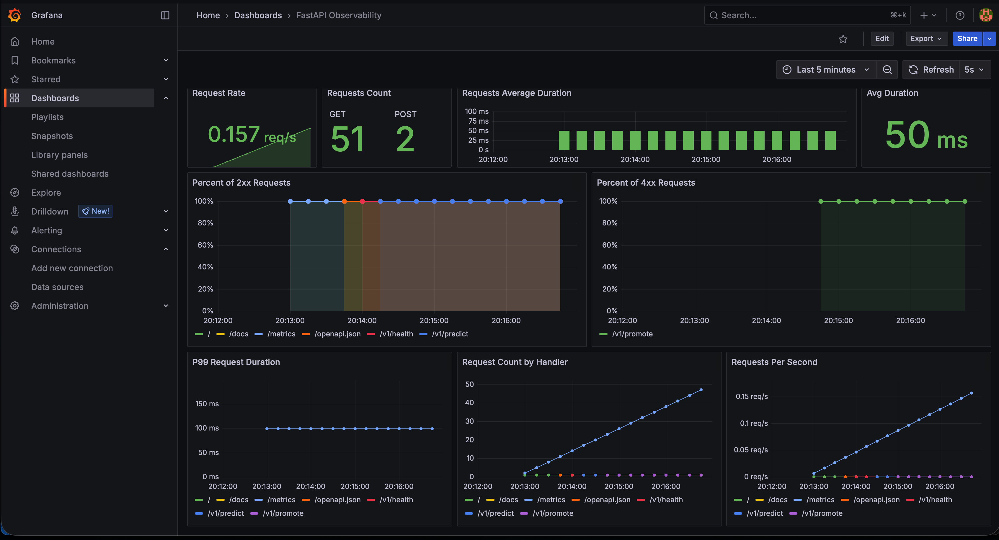
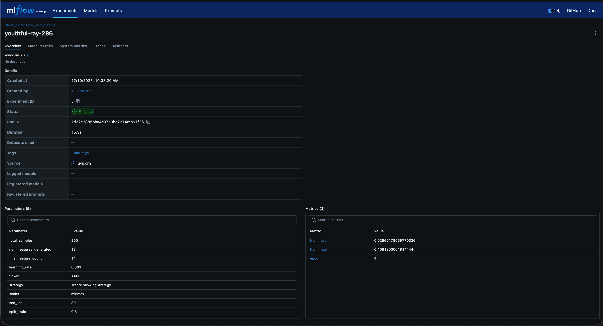
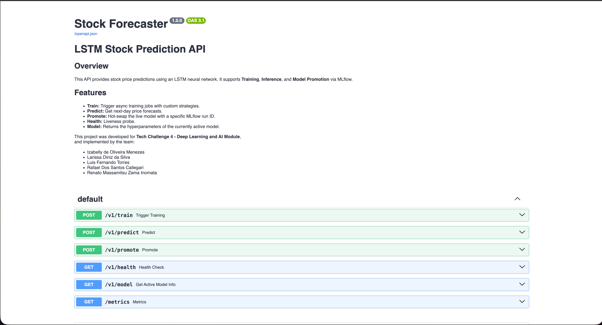

# FIAP Tech Challenge 4 - Stock Forecaster API


A production-grade MLOps application for predicting stock prices using Long Short-Term Memory (LSTM) networks. This project implements a complete end-to-end pipeline including data ingestion, feature engineering, model training, experiment tracking, and serving via a high-performance Async API.

---

## Table of Contents

- [Overview](#overview)
- [Project Structure](#project-structure)
- [Quick Start](#quick-start)
- [Setup & Installation](#setup--installation)
- [Usage](#usage)
- [Observability](#observability)
- [API Endpoints](#api-endpoints)
- [Testing](#testing)
- [Docker Commands Reference](#docker-commands-reference)
- [Authors](#authors)
- [License](#license)

---

## Overview

This application is designed with a **Service-Oriented Architecture (SOA)** pattern to decouple the Machine Learning "Engine" from the API "Interface".



**Key Features:**
*   **Deep Learning:** Custom LSTM architecture with MLP head for time-series regression.
*   **Modular Pipeline:** Robust feature engineering (RSI, MACD, SMA) using Pydantic configuration.
*   **Experiment Tracking:** Full integration with **MLflow (DagsHub)** for logging metrics, parameters, and artifacts.
*   **Async API:** FastAPI implementation with non-blocking training jobs using BackgroundTasks and Global Locks.
*   **Model Registry:** "Hot-swap" production models without restarting the server using the `/promote` endpoint.
*   **Observability:** Prometheus metrics + Grafana dashboards for real-time monitoring.
*   **Dockerized:** Ready for local development and cloud deployment.

---

## Project Structure

The project uses the `src` layout managed by `uv`.

```text
FIAP-Tech-Challenge-4/
├── .env                       # Environment variables (Credentials)
├── .dockerignore              # Excludes .venv, .git from Docker builds
├── docker-compose.yml         # Container orchestration (API + Prometheus + Grafana)
├── Dockerfile                 # Image definition (uv-based)
├── prometheus.yml             # Prometheus scrape configuration
├── pyproject.toml             # Dependencies (uv)
├── scripts/                   # Utility scripts
│   └── generate_mock_payload.py  # Creates valid /predict payloads
├── tests/                     # Pytest suite
└── src/
    └── fiap_tech_challenge_4/
        ├── config.py          # Pydantic Configurations (Data, Model, Training)
        │
        ├── api/               # Interface Layer
        │   ├── app.py         # FastAPI App, Lifespan, Landing Page
        │   ├── routes.py      # Endpoints (/train, /predict, /promote)
        │
        ├── core/              # State Management
        │   └── state.py       # Singleton ModelArtifacts (In-Memory State)
        │
        ├── data/              # Data Layer
        │   └── loader.py      # yfinance Ingestion
        │
        ├── features/          # Feature Engineering Layer
        │   ├── features.py    # Stateless Math Functions (RSI, MACD, SMA)
        │   ├── strategies.py  # Strategy Patterns (Trend/MeanReversion)
        │   └── pipeline.py    # Scaling, Splitting & Tensor Creation
        │
        ├── modeling/          # ML Core Layer
        │   ├── lstm.py              # PyTorch LSTM Architecture
        │   ├── lightning_module.py  # PyTorch Lightning Training Wrapper
        │   └── trainer.py           # Training Orchestrator + MLflow Logging
        │
        ├── schemas/           # API Contracts (DTOs)
        │   └── requests.py    # Request/Response models
        │
        └── services/          # Business Logic Layer
            ├── inference.py   # Prediction Logic
            ├── training.py    # Training Job Logic
            └── promotion.py   # Model Registry & Hot-Swap Logic
```

---

## Quick Start
Get the application running locally in minutes:

```bash
# 1. Clone the repository
git clone https://github.com/luuisotorres/FIAP-Tech-Challenge-4.git
cd FIAP-Tech-Challenge-4

# 2. Install dependencies (using uv)
uv sync

# 3. Configure environment
cp .env.example .env

# 4. Start services
docker compose up --build
```

---

## Setup & Installation

### Prerequisites
*   Python 3.12+
*   [uv](https://github.com/astral-sh/uv) (Fast Python package installer)
*   Docker & Docker Compose (for containerized runs)

### 1. Clone and Sync
```bash
git clone https://github.com/luuisotorres/FIAP-Tech-Challenge-4.git
cd FIAP-Tech-Challenge-4
uv sync
```

### 2. Configure Environment
Copy the example file and fill in your DagsHub credentials:

```bash
cp .env.example .env
```

Edit `.env` with your credentials:
```ini
# .env
MLFLOW_TRACKING_URI=https://dagshub.com/<your-username>/<your-repo>.mlflow
MLFLOW_TRACKING_USERNAME=<your-username>
MLFLOW_TRACKING_PASSWORD=<your-token>

# Required for Artifact Downloads (DagsHub S3 Proxy)
MLFLOW_S3_ENDPOINT_URL=https://dagshub.com/api/v1/repo-buckets/s3
AWS_ACCESS_KEY_ID=<your-username>
AWS_SECRET_ACCESS_KEY=<your-token>
```

---

## Usage

### Option 1: Running Locally
Start the API with hot-reloading enabled.

```bash
uv run uvicorn --app-dir src fiap_tech_challenge_4.api.app:app --reload --host 0.0.0.0 --port 8000
```

Access the application:
*   **Landing Page:** [http://localhost:8000](http://localhost:8000)
*   **Swagger UI:** [http://localhost:8000/docs](http://localhost:8000/docs)
*   **ReDoc:** [http://localhost:8000/redoc](http://localhost:8000/redoc)

### Option 2: Running with Docker Compose (Full Stack)
Build and run the entire observability stack (API + Prometheus + Grafana).

```bash
docker compose up --build
```

Access the services:
| Service    | URL                         | Credentials     |
|------------|-----------------------------|-----------------|
| API        | http://localhost:8000       | -               |
| Prometheus | http://localhost:9091       | -               |
| Grafana    | http://localhost:3000       | admin / admin   |

**Grafana Dashboard:**
The dashboard is **auto-provisioned** - no manual setup required! Just navigate to:
`http://localhost:3000/d/fastapi-observability/`

---

## Observability

### Prometheus & Grafana
The API is fully instrumented with Prometheus metrics. Use the pre-configured Grafana dashboard to monitor request latency, error rates, and resource usage.



### MLflow & DagsHub
We use **MLflow** integrated with **DagsHub** for comprehensive experiment tracking. Every training run logs:
*   **Parameters:** Hyperparameters (conf, epochs, lr, etc.)
*   **Metrics:** Loss (Training/Validation), MAE.
*   **Artifacts:** The saved PyTorch model (`.ckpt`) and scaler objects.



Access your experiments at:
```
https://dagshub.com/<your-username>/<your-repo>/experiments
```

---

## API Endpoints

Full documentation is available via Swagger UI.



| Method | Endpoint       | Description                                      |
|--------|----------------|--------------------------------------------------|
| GET    | `/`            | Landing page with links to documentation         |
| GET    | `/v1/health`   | Liveness probe (returns model loaded status)     |
| GET    | `/v1/model`    | Returns active model hyperparameters             |
| POST   | `/v1/train`    | Triggers async training job (returns 202)        |
| POST   | `/v1/predict`  | Returns next-day price forecast                  |
| POST   | `/v1/promote`  | Hot-swaps model from MLflow run ID               |

### Example: Train a Model
```bash
curl -X POST http://localhost:8000/v1/train \
  -H "Content-Type: application/json" \
  -d '{
    "experiment_name": "Stock_Forecaster_API",
    "epochs": 15,
    "learning_rate": 0.001,
    "data": {
      "ticker": "AAPL",
      "strategy_type": "trend",
      "scaler_type": "robust",
      "seq_len": 60
    },
    "model": {
      "hidden_dim": 64,
      "num_layers": 2
    }
  }'
```

### Example: Generate Mock Prediction Payload
```bash
uv run scripts/generate_mock_payload.py
# Then copy content of mock_payload.json to POST /v1/predict
```

---

## Testing

The project maintains high test coverage using `pytest` and `unittest.mock`.

```bash
# Run all tests
uv run pytest tests/

# Run with coverage report
uv run pytest tests/ --cov=src --cov-report=html
```

---

## Docker Commands Reference

```bash
# Build and start all services
docker compose up --build

# Start in detached mode
docker compose up -d

# View logs
docker compose logs -f api

# Stop all services
docker compose down

# Rebuild only the API
docker compose build api
```

---

## Authors

Developed for FIAP - Tech Challenge 4 (ML Engineering Postgraduate Program).

* Izabelly de Oliveira Menezes | [Github](https://github.com/izabellyomenezes)
* Larissa Diniz da Silva | [Github](https://github.com/Ldiniz737)
* Luis Fernando Torres | [Github](https://github.com/luuisotorres)
* Rafael dos Santos Callegari | [Github](https://github.com/rafaelcallegari)
* Renato Massamitsu Zama Inomata | [Github](https://github.com/renatoinomata)
---

## License

This project is licensed under the MIT License - see the [LICENSE](LICENSE) file for details.